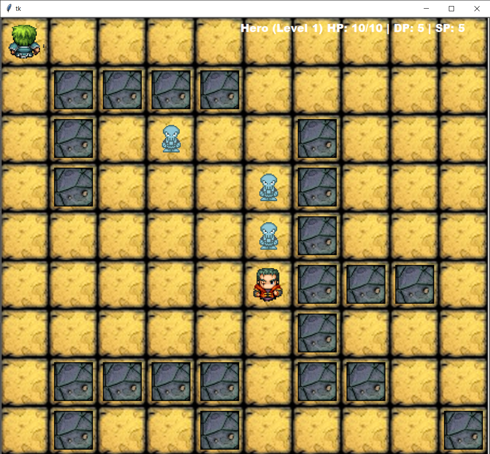

# thewanderer

Wanderer is a turn-based AARPG game created as the final project for the *Application Development Fundamentals* and the *Coding Fundamentals* courses. 



## Setup

Requirements: **Python 3.7.9** , **tkinter** (standard Python library), **pillow** and **numpy**

Install requirements:
```pip install pillow numpy```

Clone the repository, navigate to the folder and start the application using the following command:
```python main.py```

## How to play

You are controlling the hero (top left corner) and your goal is to progress through the game levels by defeating the boss and collecting the key from one of the skeletons. The boss and the skeletons have a 50% chance to move in random directions whenever your character moves. You can attack the non-player characters by stepping on the same grid and pressing the *space* key. Whenever you collect the key from a skeleton and defeat the boss, you will be automatically transferred to the next level. Once you are transferred to the next level, your hero's stats will increase and will heal (up to the maximum HP determined by your character's stats).

* W - Up
* S - Down
* A - Left
* D - Right

## Known issues
* The game is a work in progress, in the current version the striking game logic is not implemented.